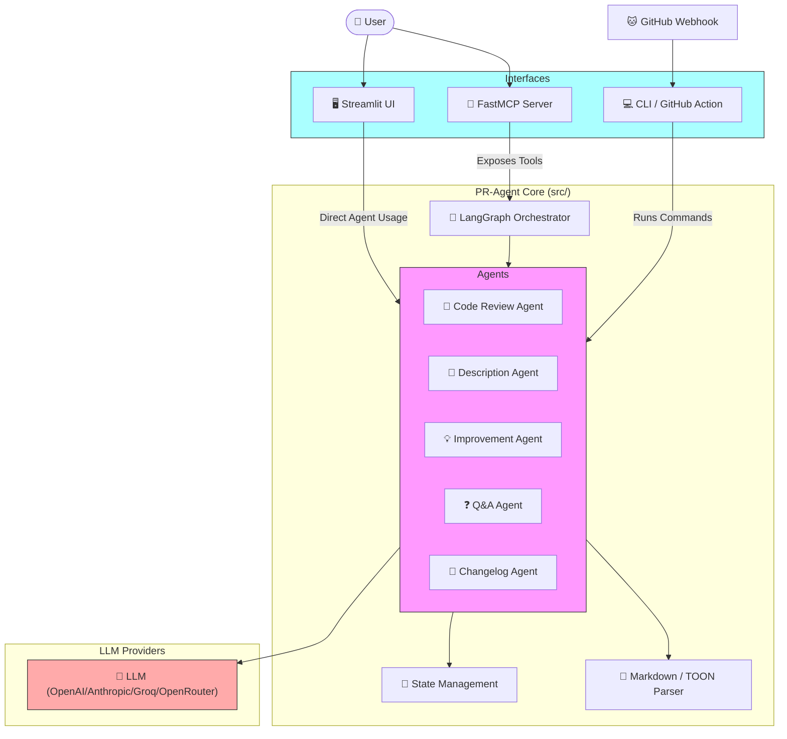

# 🤖 PR-Agent: Intelligent Pull Request Agent System

PR-Agent is an advanced AI-powered system that orchestrates multiple specialized agents to analyze, review, and document pull requests. It supports multiple interfaces including a FastMCP server, a Streamlit Web UI, and GitHub Actions CI/CD integration.

## 🏗️ System Architecture




## 📂 Directory Structure

```plaintext
pr-agent/
├── 📂 .github/              # GitHub Actions & Dependabot
│   ├── workflows/        # CI/CD Workflows
│   └── dependabot.yml    # Dependency updates
├── 📂 config/               # Configuration files
│   └── auth_config.yaml  # User authentication data
├── 📂 data/                 # Local data storage
│   └── users.json        # User database
├── 📂 docs/                 # Documentation
│   ├── CICD_SETUP.md     # GitHub Actions Setup
│   ├── PORTABLE_WORKFLOW.md # Portable usage guide
│   └── ...
├── 📂 src/                  # Source Code
│   ├── 📂 agents/        # Specialized LLM Agents
│   ├── auth.py           # Authentication logic
│   ├── analyzer.py       # Task dependency analyzer
│   ├── config.py         # Configuration management
│   ├── github_provider.py# GitHub API interaction
│   ├── graph.py          # LangGraph orchestration
│   └── toon_io.py        # Structured output parser
├── .env.example            # Environment variables template
├── cli.py                  # CLI Entry point
├── main.py                 # FastMCP Server Entry point
├── streamlit_app.py        # Streamlit Web UI Entry point
└── requirements.txt        # Python dependencies
```

## 🔄 How It Works

### 1. 🖥️ Streamlit Web UI (Interactive Mode)

**Interaction:** Users log in via the Web UI and interact directly with agents.

- **Architecture:** The Streamlit app imports agent classes (e.g., `CodeReviewAgent`) directly from `src.agents`.
- **Flow:** User Input → Streamlit App → `Agent.execute()` → LLM → Streamlit UI
- **Auth:** Uses `streamlit-authenticator` with bcrypt encryption for secure access.

### 2. 🔌 FastMCP Server (Assistant Mode)

**Interaction:** Designed for AI Assistants (like Claude Desktop) or IDEs (Cursor).

- **Architecture:** `main.py` uses `fastmcp` to expose functions as standardized tools.
- **Flow:** Claude/IDE → MCP Protocol → `main.py` → `app.ainvoke()` → Agents → Response
- **Tools:** Exposes `review_pr`, `describe_pr`, `ask_pr`, etc.

### 3. 🚀 GitHub Actions (CI/CD Mode)

**Interaction:** Validates code automatically on every Pull Request.

- **Architecture:** `cli.py` is invoked by the GitHub Action container.
- **Flow:** PR Event → GitHub Action → `cli.py` → `GitHubProvider` → Agents → PR Comment
- **Triggers:** `opened`, `synchronize`, `reopened` events or manual `workflow_dispatch`.

## 📚 Documentation

| Document                                           | Description                      |
| -------------------------------------------------- | -------------------------------- |
| [**Quick Start**](docs/QUICKSTART.md)              | Get up and running in minutes    |
| [**CI/CD Setup**](docs/CICD_SETUP.md)              | Integrate with GitHub Actions    |
| [**Portable Workflow**](docs/PORTABLE_WORKFLOW.md) | Drop-in workflow for any repo    |
| [**Security Policy**](docs/SECURITY.md)            | Vulnerability reporting & policy |

## 🚀 Getting Started

### Prerequisites

- Python 3.10+
- API Key (OpenAI, Anthropic, Groq, or OpenRouter)

### Installation

1. **Clone & Install**

   ```bash
   git clone https://github.com/pankajshakya627/PR-AGENT.git
   cd PR-AGENT
   python -m venv venv
   source venv/bin/activate
   pip install -r requirements.txt
   ```

2. **Configure Config**

   ```bash
   cp .env.example .env
   # Edit .env with your API keys
   ```

3. **Run Streamlit UI**

   ```bash
   ./run_streamlit.sh
   # Opens http://localhost:8501
   ```

4. **Run MCP Server**
   ```bash
   python main.py
   # Starts FastMCP server
   ```

## 🛡️ License

Proprietary License. See [LICENSE.md](LICENSE.md) for details.
