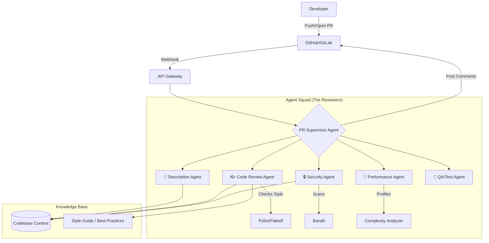

# 🤖 PR-Agent: Intelligent Pull Request Agent System

PR-Agent is an advanced AI-powered system that orchestrates multiple specialized agents to analyze, review, and document pull requests. It supports multiple interfaces including a FastMCP server, a Streamlit Web UI, and GitHub Actions CI/CD integration.

## 🏗️ System Architecture



## 📂 Directory Structure

```plaintext
pr-agent/
├── 📂 .github/              # GitHub Actions & Dependabot
│   ├── workflows/           # CI/CD Workflows
│   │   └── security-scan.yml
│   └── dependabot.yml       # Dependency updates
├── 📂 docs/                 # Documentation
│   ├── CICD_SETUP.md        # GitHub Actions Setup
│   ├── PORTABLE_WORKFLOW.md # Portable usage guide
│   ├── QUICKSTART.md        # Quick start guide
│   ├── SECURITY.md          # Security policy
│   └── STREAMLIT_FORMATTING.md
├── 📂 src/                  # Source Code
│   ├── 📂 agents/           # Specialized LLM Agents
│   │   ├── base.py          # Base agent class
│   │   └── specialized.py   # All agent implementations
│   ├── analyzer.py          # Task dependency analyzer
│   ├── auth.py              # Authentication logic
│   ├── config.py            # Configuration management
│   ├── github_commenter.py  # GitHub PR commenting
│   ├── github_provider.py   # GitHub API interaction
│   ├── graph.py             # LangGraph orchestration
│   ├── prompts.py           # Centralized LLM prompts
│   ├── state.py             # Agent state definitions
│   ├── toon_io.py           # Structured output parser
│   └── utils.py             # Utility functions
├── 📂 tests/                # Test suite
│   ├── test_functionality.py
│   └── verify_mcp.py
├── .env.example             # Environment variables template
├── cli.py                   # CLI Entry point
├── main.py                  # FastMCP Server Entry point
├── streamlit_app.py         # Streamlit Web UI Entry point
├── run_streamlit.sh         # Streamlit launcher script
├── run_agent.sh             # Agent launcher script
└── requirements.txt         # Python dependencies
```

## 🔄 How It Works

### 1. 🖥️ Streamlit Web UI (Interactive Mode)

**Interaction:** Users log in via the Web UI and interact directly with agents.

- **Architecture:** The Streamlit app imports agent classes (e.g., `CodeReviewAgent`) directly from `src.agents`.
- **Flow:** User Input → Streamlit App → `Agent.execute()` → LLM → Streamlit UI

#### 🔐 Authentication Features

| Feature             | Description                                                    |
| ------------------- | -------------------------------------------------------------- |
| **Login**           | Secure login with username/password using bcrypt hashing       |
| **Registration**    | New user registration with email and password validation       |
| **Forgot Password** | Email verification code flow for secure password reset         |
| **Change Password** | Logged-in users can update their password via sidebar expander |

**Security:**

- Passwords hashed using `bcrypt` with salt rounds (12)
- Session managed via encrypted cookies (configurable expiry: 30 days default)
- User credentials stored in `config/auth_config.yaml`
- Uses `streamlit-authenticator` library for secure authentication

### 2. 🔌 FastMCP Server (Assistant Mode)

**Interaction:** Designed for AI Assistants (like Claude Desktop) or IDEs (Cursor).

- **Architecture:** `main.py` uses `fastmcp` to expose functions as standardized tools.
- **Flow:** Claude/IDE → MCP Protocol → `main.py` → `app.ainvoke()` → Agents → Response
- **Tools:** Exposes `review_pr`, `describe_pr`, `ask_pr`, etc.

### 3. 🚀 GitHub Actions (CI/CD Mode)

**Interaction:** Validates code automatically on every Pull Request.

- **Architecture:** `cli.py` is invoked by the GitHub Action container.
- **Flow:** PR Event → GitHub Action → `cli.py` → `GitHubProvider` → Agents → PR Comment
- **Triggers:** `opened`, `synchronize`, `reopened` events or manual `workflow_dispatch`.

### 4. 🤖 Specialized Agent Squad

The system deploys a squad of specialized agents, each acting as a "Staff Engineer" in their domain:

| Agent                 | Persona           | Responsibilities                                           | Tools Integrated    |
| --------------------- | ----------------- | ---------------------------------------------------------- | ------------------- |
| **Code Review Agent** | Senior SWE        | General code quality, style, and logic checks.             | `pylint`, `flake8`  |
| **Security Agent**    | InfoSec Lead      | Vulnerability scanning (SQLi, Secrets, XSS).               | `bandit` (SAST)     |
| **Performance Agent** | SRE / Perf Expert | Identifying N+1 queries, complexity, and resource leaks.   | Complexity Analyzer |
| **Test Agent**        | QA Architect      | Verifying test coverage and suggesting missing test cases. | -                   |
| **Description Agent** | Technical Writer  | generating comprehensive PR descriptions and titles.       | -                   |

**Hybrid Neuro-Symbolic Analysis**:
Agents don't just "guess" based on the diff. They run actual static analysis tools (like `pylint` and `bandit`) on the code, ingest the structured output, and then use the LLM to interpret the results and provide actionable fixes.

### 5. 🧠 Knowledge Base (RAG)

_Note: This component is in active development._

The system utilizes a **Vector Database** (VectorDB) to provide agents with broader codebase context, moving beyond single-file analysis.

- **Purpose**: Enables agents to understand project-specific patterns, existing utilities, and architectural standards.
- **Workflow**:
  1. Codebase is indexed into a VectorDB (e.g., Chroma/Pinecone).
  2. Agents query the DB for relevant snippets (e.g., "Find all auth decorators").
  3. Retrieved context is injected into the prompt (RAG).
- **Style Guide**: A dedicated "Rules DB" ensures code adheres to team-specific conventions.

## 📚 Documentation

| Document                                           | Description                      |
| -------------------------------------------------- | -------------------------------- |
| [**Quick Start**](docs/QUICKSTART.md)              | Get up and running in minutes    |
| [**CI/CD Setup**](docs/CICD_SETUP.md)              | Integrate with GitHub Actions    |
| [**Portable Workflow**](docs/PORTABLE_WORKFLOW.md) | Drop-in workflow for any repo    |
| [**Security Policy**](docs/SECURITY.md)            | Vulnerability reporting & policy |

## 🚀 Getting Started

### Prerequisites

- Python 3.11+
- API Key (OpenAI, Anthropic, Groq, or OpenRouter)

### Installation

1. **Clone & Install**

   ```bash
   git clone https://github.com/pankajshakya627/PR-AGENT.git
   cd PR-AGENT
   python -m venv venv
   source venv/bin/activate
   pip install -r requirements.txt
   ```

2. **Configure Config**

   ```bash
   cp .env.example .env
   # Edit .env with your API keys
   ```

3. **Run Streamlit UI**

   ```bash
   ./run_streamlit.sh
   # Opens http://localhost:8501
   ```

4. **Run MCP Server**
   ```bash
   python main.py
   # Starts FastMCP server
   ```

## 🛡️ License

Proprietary License. See [LICENSE.md](LICENSE.md) for details.
